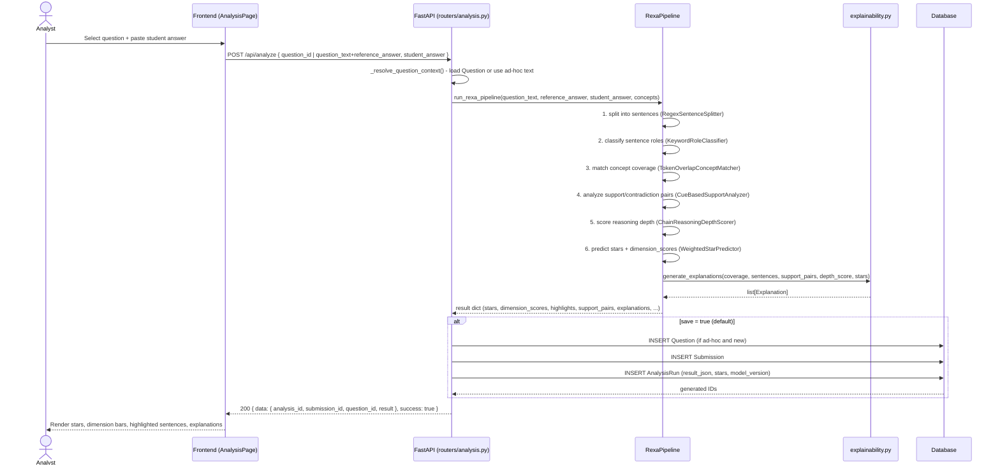
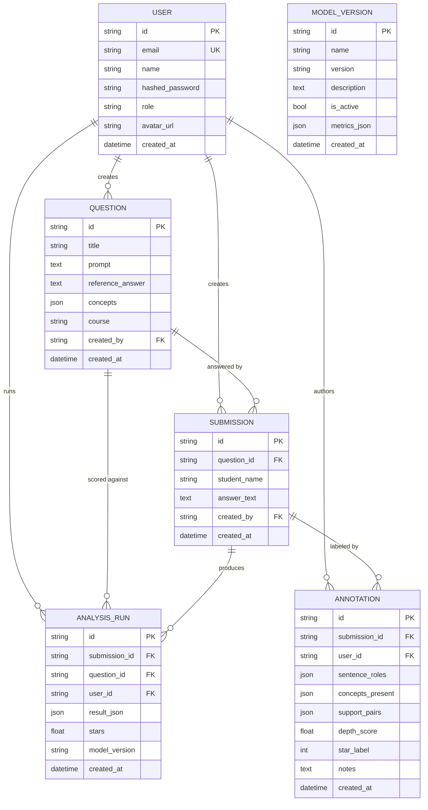

# System Architecture

**Project:** RExA — Explainable Reasoning Analysis of Descriptive Answers

This document describes the system's high-level architecture, the request/response
sequence for the core "analyze" flow, the relational data model, and key design decisions
(and known limitations) relevant to evaluating the implementation.

---

## 1. Architectural Style

EARAS follows a classic **three-tier web architecture**:

1. **Presentation tier** — a React single-page application (SPA).
2. **Application/logic tier** — a FastAPI REST API implementing authentication, CRUD
   business logic, and the REXA scoring pipeline.
3. **Data tier** — a relational database (PostgreSQL in Docker/production, SQLite for
   local development), accessed exclusively through SQLAlchemy ORM models.

Within the backend, the REXA scoring engine is further structured as a **pipeline of
single-responsibility stages**, each defined behind a narrow `typing.Protocol` interface.
This follows the **Open/Closed Principle** and **Dependency Inversion**: new stages (e.g.
a trained sentence-role classifier) can be substituted without modifying the pipeline
orchestrator, the API routers, or the Pydantic schemas.

## 2. Component Diagram

```
                         ┌───────────────────────────────────────────────────────┐
                         │                     Browser (SPA)                     │
                         │  React 19 + TypeScript + Vite + Tailwind + Radix UI   │
                         │                                                       │
                         │  pages/  → app/ (Dashboard, Analysis, Reasoning,      │
                         │             Questions, Batch, Compare, Annotation,    │
                         │             Reports, Models, Settings)                │
                         │             auth/ (Login, Register, Forgot Password)  │
                         │             landing/ (public marketing page)          │
                         │  services/ → typed fetch wrappers per resource        │
                         │  context/  → AuthProvider (JWT + user), ThemeProvider │
                         └───────────────────────────┬───────────────────────────┘
                                                       │ fetch() + Bearer <JWT>
                                                       │ JSON { data, message, success }
                                                       ▼
                         ┌───────────────────────────────────────────────────────┐
                         │                  FastAPI Application                  │
                         │                     (backend/app)                     │
                         │                                                       │
                         │  main.py        — app instance, CORS, error handlers  │
                         │  routers/       — auth, questions, analysis, batch,   │
                         │                    reports, analytics, annotations,   │
                         │                    models_admin                       │
                         │  deps.py        — get_current_user, role guards       │
                         │  security.py    — bcrypt hashing, JWT encode/decode   │
                         │  schemas/       — Pydantic request/response models    │
                         │                                                       │
                         │  ┌─────────────────────────────────────────────────┐  │
                         │  │              services/rexa_pipeline.py          │  │
                         │  │  1. RegexSentenceSplitter                        │  │
                         │  │  2. KeywordRoleClassifier                        │  │
                         │  │  3. TokenOverlapConceptMatcher (+ difflib fuzzy) │  │
                         │  │  4. CueBasedSupportAnalyzer                      │  │
                         │  │  5. ChainReasoningDepthScorer                    │  │
                         │  │  6. WeightedStarPredictor                        │  │
                         │  │       → services/explainability.py              │  │
                         │  └─────────────────────────────────────────────────┘  │
                         │  services/baselines.py — Keyword Overlap, TF-IDF,     │
                         │                           optional embeddings         │
                         │  services/reports.py   — PDF (ReportLab) / Markdown   │
                         │  models/        — SQLAlchemy ORM (User, Question,     │
                         │                    Submission, AnalysisRun,           │
                         │                    Annotation, ModelVersion)          │
                         └───────────────────────────┬───────────────────────────┘
                                                       │ SQLAlchemy engine/session
                                                       ▼
                         ┌───────────────────────────────────────────────────────┐
                         │        PostgreSQL 16 (Docker) / SQLite (local)         │
                         └───────────────────────────────────────────────────────┘
```

## 3. Sequence Diagram — "Analyze an Answer" Flow

This is the system's core flow: an analyst submits a student answer and receives a
REXA-scored, explainable result.



## 4. Data Model (Entity-Relationship Diagram)



Notes on the model:

- All primary keys are UUID strings (generated in application code, not DB sequences) —
  this keeps the schema portable between SQLite and PostgreSQL without relying on
  database-specific auto-increment or UUID extensions.
- `AnalysisRun.result_json` stores the *entire* REXA result (dimension scores, highlights,
  support pairs, explanations) as JSON, so historical results remain viewable even if the
  pipeline's internal scoring logic changes later — only `stars` and `model_version` are
  duplicated as first-class columns for fast querying/sorting.
- `ModelVersion` is intentionally decoupled from `AnalysisRun` (no foreign key) — it is a
  registry/metadata table for tracking pipeline versions and their offline evaluation
  metrics (see `docs/evaluation_report.md`), not a per-run reference.

## 5. The REXA Pipeline — Stage Interfaces

Each stage of the pipeline is defined behind a `Protocol`, allowing the heuristic
implementation used today to be replaced by a trained model later without touching the
orchestrator, the routers, or the frontend contract:

```python
class SentenceSplitterProtocol(Protocol):
    def split(self, text: str) -> list[Sentence]: ...

class RoleClassifierProtocol(Protocol):
    def classify(self, sentences: list[Sentence]) -> None: ...

class ConceptMatcherProtocol(Protocol):
    def match(self, student_answer: str, sentences: list[Sentence], concepts: list[str]) -> ConceptCoverageResult: ...

class SupportAnalyzerProtocol(Protocol):
    def analyze(self, sentences: list[Sentence]) -> list[SupportPair]: ...
```

`RexaPipeline.__init__` accepts an optional implementation for each stage (constructor
injection), defaulting to the heuristic classes described in the README. `get_pipeline()`
is the single factory function that `MODEL_MODE` would branch on to construct a
trained-model-backed pipeline in the future — no other file would need to change.

## 6. Cross-Cutting Concerns

### 6.1 Authentication & Authorization

- Stateless JWT bearer tokens, signed with `JWT_SECRET` (HS256), expiring after
  `ACCESS_TOKEN_EXPIRE_MINUTES` (default 7 days, chosen for demo/viva convenience).
- `app/deps.py` provides `get_current_user` (decodes and validates the token, loads the
  `User` row) and role-guard dependencies used by routers that mutate state (questions,
  annotations, model versions).
- Passwords are hashed with `bcrypt` before storage; plaintext passwords are never
  persisted or logged.

### 6.2 Error Handling

`app/main.py` registers three exception handlers so that **every** error response —
validation errors, HTTP errors (404/401/403/etc.), and unhandled exceptions — is
normalized to the same envelope as successful responses:

```json
{ "data": null, "message": "human readable error", "success": false }
```

This means the frontend's API client only needs one code path to detect and surface
errors, regardless of which layer raised them.

### 6.3 Configuration

All runtime configuration is centralized in `app/config.py` (`pydantic-settings`),
loaded from environment variables or a `.env` file: `DATABASE_URL`, `JWT_SECRET`,
`JWT_ALGORITHM`, `ACCESS_TOKEN_EXPIRE_MINUTES`, `CORS_ORIGINS`, `MODEL_MODE`,
`PROJECT_NAME`, `API_PREFIX`. The same codebase runs unmodified locally (SQLite) and in
Docker (PostgreSQL) purely by changing these environment variables — see
`docker-compose.yml` and `backend/.env.example`.

### 6.4 Containerization & Startup Ordering

- `backend/Dockerfile` builds a `python:3.11-slim` image, installs
  `requirements.txt`, and runs `backend/entrypoint.sh` as its entrypoint.
- `entrypoint.sh` parses `DATABASE_URL`; if it points at a network database (i.e. not
  SQLite), it polls the host:port with a raw TCP socket connection (no extra
  dependencies) until it is reachable or a 60-second timeout elapses, **before** starting
  Uvicorn. This avoids the classic "API container crash-loops because Postgres wasn't
  ready yet" problem on `docker compose up`'s first run.
- `docker-compose.yml` additionally declares a PostgreSQL `healthcheck` (`pg_isready`)
  and has `api` `depends_on: db: condition: service_healthy`, so Compose itself also
  waits for the database's health check before even starting the `api` container — the
  entrypoint script is a second, defense-in-depth layer that also protects developers who
  run the backend's Docker image outside of Compose.

## 7. Known Integration Notes / Current Limitations

This section documents the current state of the implementation honestly, for evaluation
purposes:

- **Frontend/backend contract naming.** The backend's REXA response schema
  (`RexaResult` in `app/schemas/__init__.py`) uses field names such as `dimension_scores`
  (an object keyed by dimension) and `highlights` (sentence list). The frontend's
  TypeScript types (`src/types/rexa.types.ts`) were scaffolded with a slightly different
  shape in mind (`dimensions` as an array, `sentenceRoles`, `conceptCoverage` as an
  array). A thin adapter/mapping layer in `src/services/analysis.service.ts` (or an
  equivalent transformation in the backend's response) is the recommended next step to
  fully wire the two together; this is flagged as **future work** rather than glossed
  over, since it is the kind of integration detail a defense committee will reasonably
  probe. In the meantime, the backend's interactive docs (`/docs`) are the authoritative
  source of the real response shape, and `docs/api.md` documents it precisely.
- **`MODEL_MODE=trained`** is accepted by configuration but currently falls back to the
  heuristic pipeline (`get_pipeline()` always constructs `RexaPipeline()` with its default
  heuristic stages). Wiring in a trained model is scoped as future work — the
  `Protocol`-based stage design exists specifically to make that swap low-risk.
- **Embedding baseline** (`sentence-transformers`) is optional and skipped gracefully if
  not installed, to keep the default install lightweight and GPU-free, consistent with
  the project's "no heavy ML dependency required" design goal.

## 8. Deployment View

```
┌────────────────────────────── docker compose ──────────────────────────────┐
│                                                                              │
│   ┌────────────────────┐        healthcheck: pg_isready        ┌────────┐  │
│   │        db           │◄─────────────────────────────────────│  api   │  │
│   │  postgres:16-alpine  │        DATABASE_URL (5432)            │ :8000  │  │
│   │  volume: postgres_data│                                      └───┬────┘  │
│   └────────────────────┘                                            │       │
│                                                                       │      │
└───────────────────────────────────────────────────────────────────── │ ─────┘
                                                                        │
                                                          host: localhost:8000
                                                                        │
                                                                        ▼
                                                        ┌───────────────────────┐
                                                        │  Frontend (npm run dev)│
                                                        │  localhost:5173         │
                                                        │  (or Dockerfile.frontend│
                                                        │   + nginx, optional)    │
                                                        └───────────────────────┘
```
